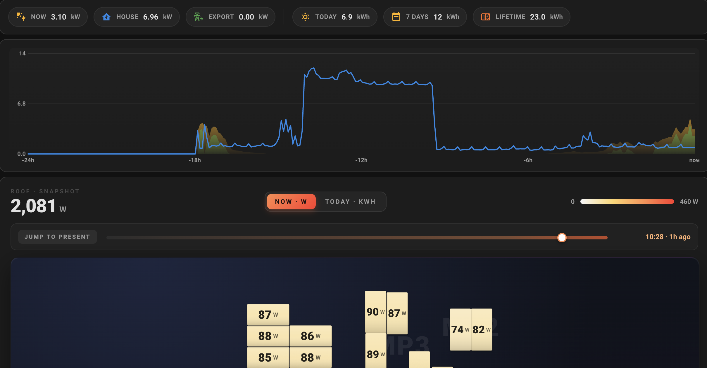
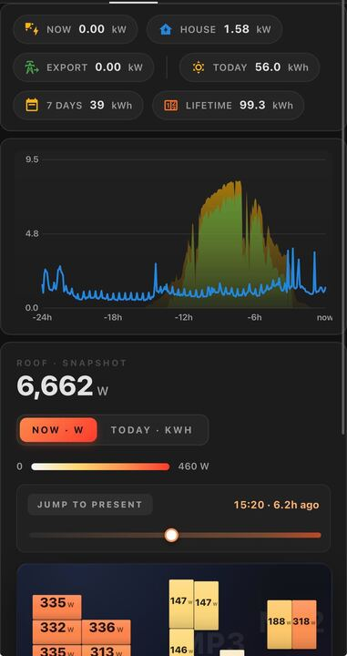

# Lovelace Enphase Cards

> Heat-mapped Enphase roof, live stats, and energy-flow chart — three Lovelace cards in one HACS install.

[](https://github.com/hacs/integration)
[](https://github.com/awolden/lovelace-enphase-cards/releases)
[](LICENSE)

[](https://my.home-assistant.io/redirect/hacs_repository/?owner=awolden&repository=lovelace-enphase-cards&category=plugin)

| Card | What it shows |
|---|---|
| `solar-layout-card` | Heat-mapped roof, panel-by-panel. Time-travel slider. Tap-to-detail. |
| `solar-stats-card` | Live chip strip — Now / House / Export / Today / 7-day / Lifetime. |
| `solar-flow-card` | 24h flow chart — production vs consumption vs exported. |



<p align="center">
  
</p>

## Setup

You need the official [Enphase Envoy HA integration](https://www.home-assistant.io/integrations/enphase_envoy/) installed first; these cards consume the entities it produces.

1. **Install** via the HACS button above (or HACS → ⋮ → Custom repositories → URL `https://github.com/awolden/lovelace-enphase-cards`, Type: **Dashboard** → Download).
2. **Grab your roof's panel layout JSON** via the bookmarklet — see [docs/getting-layout-json.md](docs/getting-layout-json.md). One click on Enlighten's Array page, JSON on your clipboard.
3. **Drop a Lovelace view** with the three cards (full preset: [examples/full-dashboard.yaml](examples/full-dashboard.yaml)):

```yaml
title: Solar
panel: true
cards:
  - type: vertical-stack
    cards:
      - type: custom:solar-stats-card
      - type: custom:solar-flow-card
        show_stats: false
        show_title: false
      - type: custom:solar-layout-card
        arrays: [...]   # paste from your bookmarklet capture
```

4. **Recommended**: enable per-inverter `*_energy_production_today` entities (Settings → Devices → your Envoy → bulk-enable) so the layout's **Today · kWh** mode has data.

## The cards in one paragraph each

**`solar-layout-card`** — pastes your panel layout JSON under `arrays:`. Heat-maps current W (or today's kWh) onto each panel in its real roof position. Time-travel slider goes back 12 hours in W mode and 14 days in kWh mode. Tap a panel to open that inverter's history. Pan with click+drag, zoom with **Ctrl/⌘ + wheel** or two-finger pinch.

**`solar-stats-card`** — zero-config, auto-discovers your Envoy entities. Six chips: live Now/House/Export and historical Today/7-day/Lifetime. Custom `metrics:` list takes over if you want different chips. Lifetime auto-scales kWh→MWh past 1000.

**`solar-flow-card`** — zero-config. 24h chart: solar production filled (amber), consumption line (blue), exported filled (green where production exceeds demand). Live header values are real entity state. Pair with `solar-stats-card` and set `show_stats: false` to skip duplicate live numbers.

Full schema and per-card overrides: [examples/](examples/).

## Troubleshooting

- **`'arrays' is required`** — you forgot the JSON, or pasted only a sub-tree. Use the [bookmarklet](docs/getting-layout-json.md) — it copies exactly the right shape.
- **Stats card says "no Enphase entities found"** — your entities don't match `sensor.envoy_*_*`. Set the `metrics:` list manually with your IDs.
- **Layout panels are blank** — your inverter entities don't match `sensor.inverter_{serial}`. Override `inverter_power_entity:` in the card config.
- **Today · kWh mode shows zeros** — per-inverter daily-kWh entities are disabled by default in HA. Enable them under Settings → Devices → your Envoy → Entities.
- **Layout looks mirrored** — `azimuth` in your JSON is wrong. 180 = south, 270 = west, 90 = east.

## Versions

[Releases](https://github.com/awolden/lovelace-enphase-cards/releases) for the changelog. PRs welcome — single self-contained JS file, no build step (the bookmarklet build is just a docs helper).

## License

[MIT](LICENSE)
